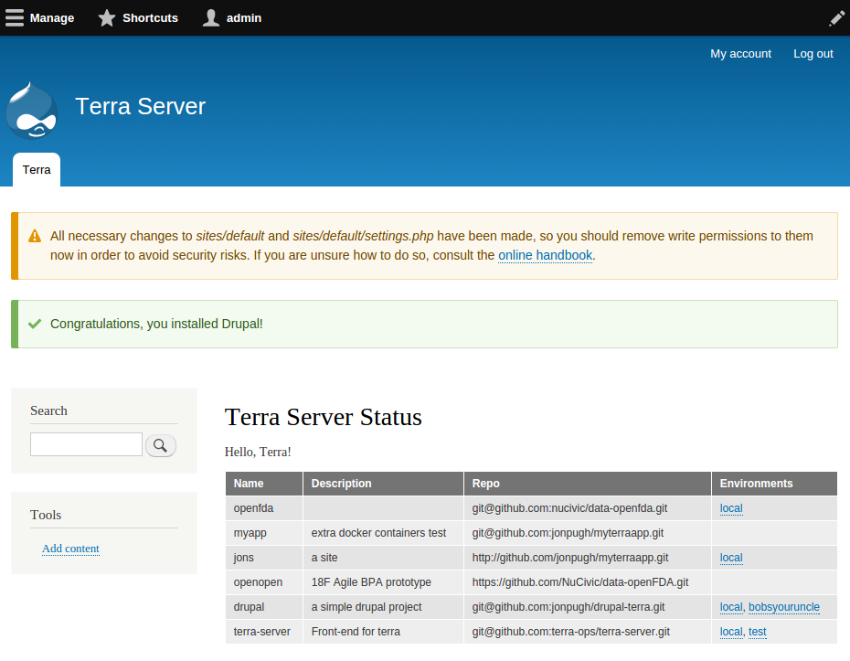

Terra Server
============

Web-based front end for Terra.

This is a Drupal 8 site that is used as the front-end for Terra.

It will fill a few roles:

- Web Interface.
- REST Interface.
- Webhook endpoints for Git integration.

Launching Terra Server
======================

You can use [Terra App](http://github.com/terra-ops/terra-app) to launch and develop Terra Server.

Once you have the [terra app installed](https://github.com/terra-ops/terra-app/blob/master/docs/install.md):

1. `terra app:add terra_server git@github.com:terra-ops/terra-server.git`
2. `terra environment:add terra_server local`
3. `terra environment:enable terra_server local`
4. Visit the URL output by terra.
5. Click through the Drupal installer, selecting "Terra Server" as your install profile.
6. Use the "drupal" for the database name, user, and password.  Use "database" for the database host.
7. Click "submit" and it will run the installer.
8. Fill out the "Configure Site" page with any information you want.
8. Done! You should now have a fully working drupal 8 site that shows the list of apps terra is tracking!

How This Works
==============

Terra Server runs on a machine managed by the terra app.

The terra server app has an additional volume mounting the terra-app's config folder (~/.terra) to `/var/terra` inside the container.

The `terra_server` module has a configuration `path_to_config` which is set to `/var/terra` by default.

This way, the Terra server can read the same config file that the terra app uses.
